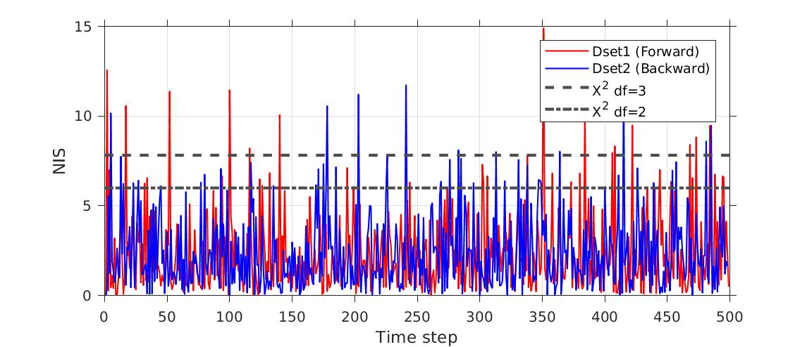

# Unscented Kalman Filter Project

Self-Driving Car Engineer Nanodegree Program

**The goal of this project is to utilize an unscented kalman filter with a constant turn rate and velocity model to estimate the state of a moving object of interest with noisy lidar and radar measurements.**

## Code structure
The project code is broken up into several different classes:
* Abstract `UKF` class.
* Abstract `Sensor` class.
* A `FusionUKF` class.

### `UKF` class
The purpose of the UKF class is to contain all Kalman filter code, such as the Predict and Update methods, as well as contain all methods for the unscented transformation. The primary public methods include:
* `Init(x,P)`: Initialize the KF using the state `x` and covariance `P`.
* `setProcessNoise(noise)`: Set the process noise vector.
* `Predict(dt)`: Predict what the state vector will be in `dt` time.
* `Update(measurement, Sensor)`: Use a measurement produced from a Sensor to update the KF state/covariance.

There are two private abstract methods that must be implemented by a specific UKF model class:
* `ProcessModel(SigmaPoints, dt)`: Apply a model that propagates the sigma points (state vectors) forward by `dt` time.
* `labelParametersAsAngle(isAngle)`: Set which state parameters are angles. _This is used for normalizing any angles_.

#### Concrete `UKF` class
The abstract UKF class is used to define the `CTRV` class, which implements the constant turn rate and velocity model.

### `Sensor` class
The purpose of the sensor class is to hold data and methods that are unique to the sensor. The data the class holds are
* The measurement noise covariance matrix, `R`.

The abstract methods include
* `state_to_measure(state)`: Convert from state space to measurement space.
* `measure_to_state(meas)`: Convert from measurement space to state space.

#### Concrete `Sensors`
The abstract `Sensor` class is used to define two different concrete classes, `Radar` and `Lidar`. These classes implement the virtual functions listed above.

### `FusionUKF` class
This class handles fusing data from multiple sensors to track a object. This class has one method
* `ProcessMeasurement(MeasurementPackage)`: primary method that initializes the Kalman filter using the first measurement, and then updates it using subsequent measurements.

and contains instances of the `CTRV`, `Radar`, and `Lidar` classes.

## Parameter values

#### Process noise values
I use process noise values of &sigma;a = 0.2 and &sigma;d2&psi;/dt2 = 0.2. This linear acceleration noise would approximately correspond to a biker accelerating from a stop to 44 m/s over 10 seconds.

#### Initialization values
I only used the most basic initialization, the first measurement. The covariance was initialized using `[0.2, 0.2, 7, 0.1, 0.1]` along the diagonal.

## Results
The final RMSE values obtained were `X=0.0634`, `Y=0.0832`, `Vx=0.3331`, and `Vy=0.1661`. Additionally the NIS values are shown in the image below. _These values are using both Lidar and Radar_.

### Notes
I modified the source list in CMakeLists.txt to include the necessary files.
